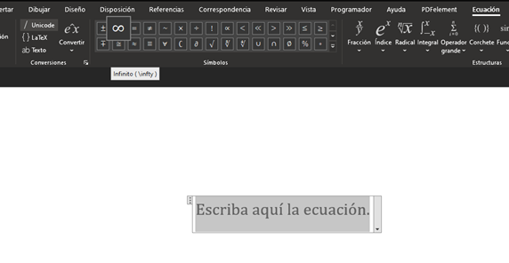
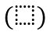
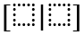

# Matemáticas en *MS* *Office*

## Motivación

Por medio de herramientas de *Microsoft Office* como *Word* y *PowerPoint* podemos construir documentos convencionales como ensayos, cartas, contratos o presentaciones. ¿Qué hacemos cuando nuestro contenido a desarrollar debe incluir expresiones matemáticas elaboradas? Podriamos expresarlas de forma primitiva, sin prestar atención al estilo, como la siguiente formula cuadrática: x=(-b±√(b^2-4ac))/2a, pero, por lo general, esta forma es poco amistosa con el lector ya que es dificil de interpretar y con el autor ya que es dificil de identificar si está escrita de forma correcta. Preferiblemente, quisieramos expresar ecuaciones embebidas en el texto, como $x=\frac{-b\pm\sqrt{b^2-4ac}}{2a}$, o en su propio renglón para dar énfasis:

$$
	x=\frac{-b\pm\sqrt{b^2-4ac}}{2a}\text{.}
$$

Mejor aún, esta forma tipográfica de expresiones matemáticas nos permite más flexibilidad en cuanto a los símbolos que podremos utilizar. Particularmente nos interesan las operaciones sobre conjuntos como la sumatoria,

$$
	\sum_{i\in I}a_{i}x_{i}=b\text{,}
$$

que nos permiten plantear de forma generalizada hiperplanos, los cuales entendemos como restricciones o función objetivo en los modelos de programación lineal o lineal-entera.

Esta guía busca fijar convenciones para el desarrollo de informes con contenido matemático para el curso, así como dar instrucciones para trabajar de forma eficiente y dominar la composición tipográfica con *MS Office*.

## Primeros pasos

Asegurese de tener instalado la suite de *MS Office*. El procedimiento para insertar ecuaciones es aplicable en la mayoría de los programas del paquete, pero nosotros nos enfocaremos en la composición de documentos con *Word*.

Ejecute *Word* y dirijase a la pestaña del *Ribbon*, **Insertar**. Allí, coloque su cursor sobre el elemento **Ecuación**. Al tener el cursor sobre el botón, debería desplegarse una caja de texto explicando su uso. Verifique que *Word* le haya asignado un atajo de teclado (para el autor, el atajo es `Alt` + `=`).


Si no tiene un atajo asignado, puede hacerlo dirijiendose a la pestaña del *Ribbon*, **Archivo** >> **Opciones** >> **Personalizar cinta de opciones** >> **Personalizar**. Al especificar un comando, seleccione la categoría *Todos los comandos* y en comandos, *InsertarEcuación*. Teclée un atajo y verifique que haya quedado asignado. Tener un atajo asignado es importante para tener un flujo de trabajo eficiente, ya que, en el proceso de desarrollar un informe, deberá insertar muchas expresiones matemáticas.

## Estructura de informe

Por lo general, las evaluaciones del curso consisten del planteamiento de un escenario a optimizar para el cual el estudiante debe construir un modelo de programación matemática lineal o lineal-entero. Para plantear modelos generalizados, utilizamos conjuntos, símbolos representativos de parámetros, arreglos de variables y conjuntos de restricciones. Por conveniencia para la evaluación de su entrega, recomendamos enunciar cada uno de estos componentes explicitamente. A continuación, una vista de como debe quedar su documento.

&ensp;&ensp;**Conjuntos**

&ensp;&ensp;&ensp;&ensp;&ensp;&ensp;$I$: primer conjunto del ejemplo.

&ensp;&ensp;&ensp;&ensp;&ensp;&ensp;$J$: segundo conjunto del ejemplo.

&ensp;&ensp;**Parámetros**

&ensp;&ensp;&ensp;&ensp;&ensp;&ensp;$a_{ij}$: primer parámetro del ejemplo. Elemento $a$ para todo $i\in I$,$j\in J$.

&ensp;&ensp;&ensp;&ensp;&ensp;&ensp;$b_{i}$: segundo parámetro del ejemplo. Elemento $b$ para todo $i\in I$.

&ensp;&ensp;&ensp;&ensp;&ensp;&ensp;$c_{j}$: costos del ejemplo. Elemento $c$ para todo $j\in J$.

&ensp;&ensp;**Variables**

````{margin}
```{admonition} Nota
Si $x_{j}$ son variables binarias, podemos expresarlas con una función a trozos.
```
**Variables**

$$
	x_{j}=\begin{cases}
					1 & \text{se cumple un criterio} \\
					0 & \text{d.l.c.}
   \end{cases}\text{.}
$$

````

&ensp;&ensp;&ensp;&ensp;&ensp;&ensp;$x_{j}$: primeras variables del ejemplo. Decisión $x$ para todo $j\in J$.

&ensp;&ensp;**Naturaleza**

````{margin}
```{admonition} Nota
NUNCA puede faltar una expresión explicita del dominio del problema (Naturaleza). Las variables pueden tomar valores en conjuntos predeterminados:
```
Algunas alternativas:

\begin{gather*}
	x_{j}\in\mathbb{R_{\geq 0}} & \forall j \in J \\
	x_{j}\in\mathbb{N} & \forall j \in J \\
	x_{j}\in\{0,1\} & \forall j \in J
\end{gather*}

````

\begin{gather*}
	x_{j}\in\mathbb{R} & \forall j \in J
\end{gather*}

&ensp;&ensp;**Restricciones**

\begin{gather*}
		\sum_{j\in J}a_{ij}x_{j}=b_{i} & \forall i\in I
\end{gather*}

> Este conjunto de restricciones nos permite identificar la región factible del problema. Este parrafo, idealmente, contendría una breve descripción de lo que representa o logra su respectivo conjunto de restricciónes.

&ensp;&ensp;**Función Objetivo**

$$
		\max{\sum_{j\in J}c_{j}x_{j}}
$$

> Esta sumatoria nos permite identificar los valores de las variables de decisión que maximizan el problema según el criterio escogido. Este parrafo, idealmente, contendría una breve descripción de lo que representa o logra su respectiva función objetivo.

## Expresiones matemáticas

````{margin}
```{admonition} Nota
Las siguientes son tan solo sugerencias y convenciones para la composición tipográfica de matemática. Recomendamos adaptarlas a sus preferencias.
```
````

Veremos ahora cómo escribir ecuaciones matemáticas en *Word*. En general, los símbolos tienen nombres y el programa tiene tres criterios para identificar cuando queremos insertarlos. Primero, debemos estar escribiendo dentro de un bloque de **Ecuación**; segundo, el nombre del símbolo debe indicarse con el caracter '`\`'; tercero, debemos insertar un espacio despues del comando referente a la expresión matemática deseada (por ejemplo, para insertar un simbolo $\alpha$, escribiriamos en el bloque de ecuación el código `\alpha` e insertariamos un espacio para producir el símbolo).


### Símbolos comunes

Especificamente para el curso, utilizamos símbolos representativos de conjuntos y operaciones sobre conjuntos. *Word* ofrece una paleta de símbolos extensa y podemos consultarla bajo la pestaña **Ecuación** que aparece una vez ubicamos el cursor sobre un bloque de ecuación. Colocar nuestro cursor de mouse sobre alguno de los símbolos de la paleta, habilita un texto flotante con el nombre del comando que utilizaría uno para insertarlo. Por ejemplo, en la imagen a continuación se puede observar que al ubicar el cursor sobre el símbolo de infinito, nos muestra un texto flotante con el comando `\infty`.



Los comandos son fáciles de memorizar ya que, por lo general, son el nombre del símbolo o una abreviación. A continuación, un listado de los símbolos más comunes como referencia rápida.

| Símbolo | Comando |  | Símbolo | Comando |
| :-: | :-: | :-: | :-: | :-: |
| $\alpha$ | `\alpha` |  | $\mathbb{R}$ | `\doubleR` |
| $\beta$ | `\beta` |  | $\mathbb{N}$ | `\doubleN` |
| $\gamma$ | `\gamma` |  | $\Gamma$ | `\Gamma` |
| $\theta$ | `\theta` |  | $\sigma$ | `\sigma` |
| $\phi$ | `\phi` |  | $\tau$ | `\tau` |
| $\lambda$ | `\lambda` |  | $\Lambda$ | `\Lambda` |
| $\mu$ | `\mu` |  | $\chi$ | `\chi` |
| $\infty$ | `\infty` |  | $\varepsilon$ | `\varepsilon` |
| $\forall$ | `\forall` |  | $\in$ | `\in` |
| $\cdots$ | `\cdots` |  | $\times$ | `\times` |
| $\cdot$ | `\cdot` |  | $\pm$ | `\pm` |
| $\neq$ | `\neq` |  | $\approx$ | `\approx` |
| $\rightarrow$ | `\rightarrow` |  | $\leftarrow$ | `\leftarrow` |
| $\Rightarrow$ | `\Rightarrow` |  | $\Leftarrow$ | `\Leftarrow` |
| $\cup$ | `\cup` |  | $\cap$ | `\cap` |

Algunos símbolos (como $>$, $<$, $=$, $/$, $*$, etc.) pueden insertarse directamente desde el teclado y, por lo tanto, no tienen comando. Otros (como $\geq$ o $\leq$) son el resultado de la composición de los símbolos básicos. Por ejemplo, `...` produce $\ldots$, o `>` y `=` que juntos producen $\geq$.

### Paréntesis, corchetes, llaves y fracciones

Aunque utilizar paréntesis, corchetes y llaves puede parecer trivial, en la composición de tipografía matemática es usual que estos se ajusten al tamaño de su contenido. Particularmente en *Word*, existe el componente de corchetes que contiene una o varias celdas sobre las que se pueden escribir ecuaciones. El comando `()` seguido de la tecla espacio inserta una celda de ecuación encerrada por paréntesis a ambos lados. La siguiente tabla muestra algunos comandos que insertan celdas de ecuaciones con propiedades peculiares, así como ejemplos de como estos signos de puntuación pueden combinarse.

| Celdas | Comando |  | Celdas | Comando |
| :-: | :-: | :-: | :-: | :-: |
|  | `()` |  |  | `[)` |
|  | `[]` |  |  | `[\close` $\rightarrow$ `[┤` |
|  | `{}` |  |  | `||` |
|  | `[|]` |  |  | `/` |

Note que para cerrar los paréntesis sin el símbolo de la derecha, debe insertar el símbolo del comando `\close`, '┤'.

### Acentos e índices 

De forma similar a los paréntesis y las fracciones, los acentos pueden producir celdas de ecuación en las cuales escribiremos el contenido que deben cubrir. Debemos ser cuidadosos al insertar acentos, ya que, si seguimos escribiendo dentro de sus respectivas casillas, podemos terminar cubriendo toda una expresión matemática en un acento.

| Bien | Mal |
| :-: | :-: |
| $\bar{X}=\frac{\sum_{i=1}^{n}x_i}{n}$ | $\overline{X=\frac{\sum_{i=1}^{n}x_i}{n}}$ | 

````{margin}
```{admonition} Nota
Las casillas de los acentos aparecen luego de oprimir dos veces la tecla espacio.

El primer tecleo inserta el acento y el segundo se lo pone al caracter que tenga detrás. Si no hay caracter alguno, se inserta la celda vacía.
```
````

A continuación, unos acentos de uso frecuentes y unos ejemplos de como usar subindices y superindices (comandos `_` y `^` respectivamente).

| Celdas | Comando |  | Celdas | Comando |
| :-: | :-: | :-: | :-: | :-: |
|  | `\bar` |  |  | `\dot` |
|  | `\hat` |  |  | `^` |
|  | `\vec` |  |  | `_` |


Note que para insertar un subíndice o un superíndice (o potencia) debe primero insertar una caracter cualquiera sobre el cual actua el índice (por ejemplo `a^` o `a_`). Este caracter puede editarlo luego.

### Matrices

Las matrices son los elementos más complicados de editar una vez insertadas y pobldas, por lo que recomendamos planear bien las dimensiones con anterioridad. Para insertar una matriz debe primero utilizar el comando `\matrix`, seguido de una combinación de `&`s y `@`s. Cada `&` implica una columna nueva y cada `@` una fila nueva.

Si está insertando una matriz vacía para luego llenarla (recomendable), basta con insertar la siguiente secuencia de comandos. `\matrix` $\rightarrow$ `■` $\rightarrow$ `■(&&@)`. Esto produciría una matriz 2x3, pero usted puede insertar cuantas filas y columnas desée. Adicionalmente, una vez haya insertado la matriz definitiva, puede hacer clic derecho sobre alguna celda de la matriz y agregar o remover filas o columnas.


Note que, como cualquier otra expresión matemática en *Word*, las matrices pueden insertarse en celdas de ecuación de otras expresiones, lo que nos permite encerrarlas en paréntesis, darles acentos y asignarles índices y potencias como a cualquier otro eleménto matemático.

### Operadores generalizados

Tenemos también operaciones sobre conjuntos que podemos insertar según su hogar en el catálogo de la pestaña **Ecuación**, o por comandos si los conocemos. Identifique en la siguiente tabla algunos comandos importantes.

| Operación | Comando | Con índices | Composición |
| :-: | :-: | :-: | :-: |
| $\sum$ | `\sum` | $\sum_{i=1}^{n}$ | `\sum_(i=1)^(n)` |
| $\bigcup$ | `\bigcup` | $\bigcup_{i=1}^{n}$ | `\bigcup_(i=1)^(n)` |
| $\int$ | `\int` | $\int_{0}^{\infty}$ | `\int_(0)^(\infty)` |
| $\iint$ | `\iint` | $\iint_{D}$ | `\iint_(D)` |
| $\prod$ | `\prod` | $\prod_{i\in I}$ | `\prod_(i\in I)` |

Los operadores generalizados siempre se insertan con una celda de ecuación a su derecha para que se les asignen los elementos sobre los que actúan. Esto quiere decir que podemos anidarlos indefinidamente y así obtener expresiones como a las que estamos acostumbrados para funciones objetivo o restricciones en los modelos de programación matemática. Vea el siguiente ejemplo de como componer una doble sumatoria representativa de una restricción general. Preste atención a como se anidan las expresiones y como la desigualdad se inserta en la celda exterior.


## Ejemplo: Family Knapsack

En esta sección encontrará una posible formulación para el problema al que se habrá enfrentado en sus complementarias del knapsack familiar, donde una familia de excursionistas debe decidir qué objetos lleva cada integrante de la familia de acuerdo con ciertas restricciones adicionales. Lo importante de la siguiente formulación son los mensajes desplegables que contienen el texto tal y como se escribiría en *Word*. El texto en `esta forma`, se refiere al código que uno escribiría en los bloques de ecuación. Puede descargar este desarrollo en *Word* [aquí](https://github.com/copa-uniandes/optimizacion/raw/master/optimizacion/Guias/MS%20Office/samples/Ejemplo%20uso%20de%20ecuaciones%20y%20formato%20en%20MS%20Word.docx).

&ensp;&ensp;**Conjuntos**

&ensp;&ensp;&ensp;&ensp;&ensp;&ensp;$E$: conjunto de excursionistas.

&ensp;&ensp;&ensp;&ensp;&ensp;&ensp;$O$: conjunto de objetos.

:::{admonition,dropdown,tip} ¡Click acá!
`E`: conjunto de excursionistas.

`O`: conjunto de objetos.
:::

&ensp;&ensp;**Parámetros**

&ensp;&ensp;&ensp;&ensp;&ensp;&ensp;$b_{j}$: peso máximo que puede cargar el excursionista $j\in E$

&ensp;&ensp;&ensp;&ensp;&ensp;&ensp;$p_{i}$: peso del objeto $i\in O$

&ensp;&ensp;&ensp;&ensp;&ensp;&ensp;$q_{ij}$: preferencia sobre el objeto $i\in O$ del excursionista $j\in E$

:::{admonition,dropdown,tip} ¡Click acá!
`b_(j)`: peso máximo que puede cargar el excursionista `j\in E`

`p_(i)`: peso del objeto `i\in O`

`q_(ij)`: preferencia sobre el objeto `i\in O` del excursionista `j\in E`
:::

&ensp;&ensp;**Variables**

$$
	x_{ij}=\begin{cases}
					1 & \text{el objeto }i \in O\text{ es llevado por el excursionista } j\in E \\
					0 & \text{d.l.c.}
   \end{cases}
$$

:::{admonition,dropdown,tip} ¡Click acá!
`x_ij={■(1&el objeto i∈O es llevado por el excursionista j∈E@0&d.l.c.)┤`

Note que para esta función a trozos, el contenido de la llave es una matriz.
:::

&ensp;&ensp;**Naturaleza**

\begin{gather*}
	x_{ij}\in\{0,1\} & \forall i \in O, j \in E
\end{gather*}

:::{admonition,dropdown,tip} ¡Click acá!
`x_ij\in{0,1}\forall i\in E, j\in O`
:::

&ensp;&ensp;**Restricciones**

\begin{gather*}
		\sum_{i\in O}p_{ij}x_{ij}\leq b_{j} & \forall j\in E
\end{gather*}

> Estas restricciones evitan que los objetos cargados por cada excursionista, $j\in E$, excedan su peso máximo tolerable, $b_{j}$.

:::{admonition,dropdown,tip} ¡Click acá!
`\sum_(i\in O)p_(ij) x_(ij) <= b_(j) \forall j\in E`

Estas restricciones evitan que los objetos cargados por cada excursionista, `j\in E`, excedan su peso máximo tolerable, `b_{j}`.
:::

\begin{gather*}
		\sum_{j\in E}x_{ij}=1 & \forall i\in O
\end{gather*}

> Estas restricciones garantizan que cada objeto, $i\in O$, se lleve exactamente una vez entre los excursionistas. Evita objetos repetidos o que falte algún objeto.

:::{admonition,dropdown,tip} ¡Click acá!
`\sum_(j\in E) x_(ij) =1\forall i\in O`

Estas restricciones garantizan que cada objeto, `i\in O`, se lleve exactamente una vez entre los excursionistas. Evita objetos repetidos o que falte algún objeto.
:::

&ensp;&ensp;**Función Objetivo**

$$
		\max{\sum_{i\in O}\sum_{j\in E}q_{ij}x_{ij}}
$$

> Esta función objetivo nos permite identificar la satisfacción total alcanzada por la familia por los objetos respectivos de cada integrante. Al maximizar la expresión, obtenemos la política óptima en cuanto a satisfacción total.

:::{admonition,dropdown,tip} ¡Click acá!
`max \sum_(i∈O) \sum_(j∈E) (q_ij x_ij ) `

Esta función objetivo nos permite identificar la satisfacción total alcanzada por la familia por los objetos respectivos de cada integrante. Al maximizar la expresión, obtenemos la política óptima en cuanto a satisfacción total.
:::

## Siguientes pasos

Aunque *Word* es una herramienta muy versatil para la composición de documentos, puede tener limitaciones para la tipografía matemática o en la composición de documentos de investigación más formales. Para quienes buscan mayor rigor matemático, flexibilidad en el diseño de sus documentos y están dispuestos a explorar las tecnologías con las que los académicos construyen sus articulos de investigación, recomendamos aprender [*LaTeX*](https://www.overleaf.com/).

## Créditos
Equipo Principios de Optimización<br>Desarrollo: Alejandro Mantilla<br>Edición: Alfaima Solano<br>Fecha: 10/11/2020<br>
